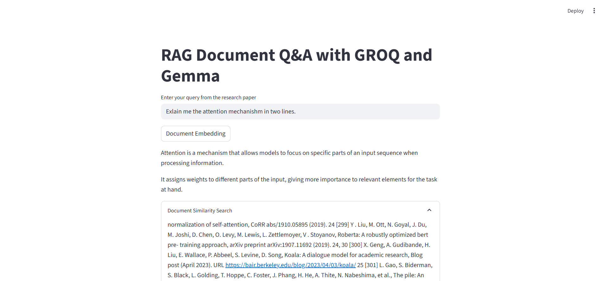

# 📚 RAG Document Q&A Chatbot — Powered by GROQ and Gemma

 <!-- Replace this with your actual image path -->

This is a **Retrieval-Augmented Generation (RAG)** chatbot application built with **Streamlit**, **LangChain**, and **GROQ's Gemma 2B-9B model**. It allows users to query content from multiple research papers or PDFs using semantic search powered by **FAISS** and **HuggingFace Embeddings**.

---

## ✨ Features

- 🔍 Ask questions from research papers (PDFs)
- 📁 Automatically splits documents and creates vector embeddings
- 🧠 Uses GROQ's `gemma2-9b-it` LLM for accurate answers
- ⚡ Fast and efficient vector retrieval using FAISS
- 🖼️ Context and similarity search with document chunks

---

## 📦 Tech Stack

- [Streamlit](https://streamlit.io/)
- [LangChain](https://www.langchain.com/)
- [FAISS (Facebook AI Similarity Search)](https://github.com/facebookresearch/faiss)
- [HuggingFace Transformers](https://huggingface.co/)
- [GROQ Inference API](https://groq.com/)
- Python 3.10+

---

## ⚙️ Setup Instructions

### 1. Clone the Repository

```bash
git clone https://github.com/anasmalik081/RAG-Question-Answering-Chatbot.git
cd rag-document-chatbot
```

### 2. Create a Virtual Environment

```bash
python -m venv env
```

Or using Conda:

```bash
conda create -p venv python=3.10 -y
```

### 3. Activate the Environment

- **Windows**:
  ```bash
  .\env\Scripts\activate
  ```
- **macOS/Linux**:
  ```bash
  source env/bin/activate
  ```

### 4. Install Requirements

```bash
pip install -r requirements.txt
```

### 5. Set Up Environment Variables

Create a `.env` file in the root directory and add your GROQ or other API keys:

```env
# Example:
GROQ_API_KEY=your_groq_api_key
```

### 6. Prepare Documents

Place all your research papers or documents in the following folder:

```
research_papers/
```

### 7. Run the Application

```bash
streamlit run app.py
```

---

## 🖼️ Sample UI

> Replace the placeholder below with your own screenshot or gif inside the `assets/` folder.


---

## 📁 File Structure

```
rag-document-chatbot/
├── app.py
├── requirements.txt
├── .env
├── README.md
├── research_papers/
└── assets/
    └── rag-chatbot-demo.png
```

---

## 🙋‍♂️ Contributing

Contributions are welcome! Open issues or submit PRs for improvements, bug fixes, or feature suggestions.

---

## 📬 Contact

- **Author**: Aarish Malik  
- **LinkedIn**: [linkedin.com/in/anas-malik-01](https://linkedin.com/in/anas-malik-01/)

---

> Built with 💡 by combining RAG + Gemma + LangChain
